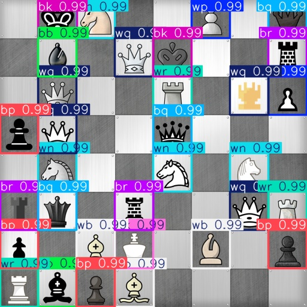

# Chess Pieces Detection

[](https://github.com/SIIR3X/network-segmenter/blob/main/LICENSE)



## Description

**Chess Pieces Detection** is a computer vision project designed to train a deep learning model capable of detecting and classifying chess pieces on a board using synthetic image data. The project leverages the YOLOv8 architecture (via Ultralytics) for high-speed and accurate object detection. Its pipeline includes synthetic dataset generation, data cleaning, GPU-enabled training, evaluation, and ONNX export for deployment.

This project is optimized for **2D chessboards**, such as those from digital screenshots or top-down camera views.

You can also build your **own synthetic dataset** by simply adding new board and piece images in the `/data/raw/` directory. Synthetic labeled images are then automatically generated by combining random board backgrounds with random piece placements.

The training behavior and hyperparameters are defined in the configuration file located at `/config/train_config.yaml`.

## Features

- **Synthetic Dataset Generation**
    - Automatically generates random chessboard images with labeled pieces
    - Configurable board layouts and piece types
    - Implemented in: `src/data/generator.py`, `scripts/generate_synthetic_boards.py`

- **Data Structure**
    - Organized dataset format (YOLO-style) with:
    - `train/`, `val/`
    - `images/`, `labels/`
    - Automatically generates label `.txt` files and splits
    - Implemented in: `src/data/loader.py`

- **Model Training (YOLOv8)**
    - Utilizes Ultralytics YOLOv8 for training and inference
    - Supports GPU acceleration and caching for faster training
    - Implemented in: `src/training/runner.py`, `scripts/train.py`

- **Export and Inference**
    - Exports trained models to ONNX format for deployment
    - Runs predictions on images and visualizes results
    - Implemented in: `scripts/predict.py`


## Project Structure

```bash
chess-pieces-detection/
├── config/               # YAML config files for training
├── data/
│   ├── raw/              # Raw boards and pieces images
│   └── dataset/          # Generated YOLO dataset (train/val)
├── models/               # Downloaded YOLO weights
├── scripts/              # CLI entry points (generate, train, clean, predict)
├── src/
│   ├── data/             # Dataset loaders and generators
│   ├── utils/            # Model management, cleaning, helpers
│   └── training/         # Training logic and wrapper
├── runs/                 # YOLO training results
├── requirements.txt
├── LICENSE
└── README.md
```


## Installation

### Dependencies

Install the required Python packages using pip:

```bash
pip install -r requirements.txt
```


## Usage

The project provides several scripts for different tasks:

### Generate Synthetic Boards

- **Script**: `scripts/generate_synthetic_boards.py`

- **Arguments**:
    - `--board_dir`: path to raw board images (default: `data/raw/boards/`)
    - `--pieces_dir`: path to raw piece images (default: `data/raw/pieces/`)
    - `--output_dir`: output directory for generated dataset (default: `data/dataset/`)
    - `--num_boards`: number of boards to generate (default: `1000`)
    - `--seed`: random seed for reproducibility (default: `42`)
    - `--workers`: number of parallel workers (default: `8`)

### Train YOLOv8 Model

- **Script**: `scripts/train.py`

- **Arguments**:
    - `--config`: path to YAML config file (default: `config/train_config.yaml`)

### Predict with Trained Model

- **Script**: `scripts/predict.py`

- **Arguments**:
    - `--model`: path to trained YOLOv8 model (required)
    - `--source`: path to input image or directory (required)
    - `--output`: directory to save predictions (default: `predictions/`)
    - `--conf`: confidence threshold for predictions (default: `0.25`)
    - `--show`: whether to display predictions

### Clean dataset

- **Script**: `scripts/clean_dataset.py`

- **Arguments**:
    - `--dataset_dir`: path to dataset directory (default: `data/dataset/`)

### Clean runs

- **Script**: `scripts/clean_runs.py`

- **Arguments**:
    - `--run`: path to runs directory
    - `--all`: clean all runs
    - `--dir`: base directory for runs (default: `runs/`)


## License

This project is licensed under the MIT License. See the [LICENSE](LICENSE) file for details.
